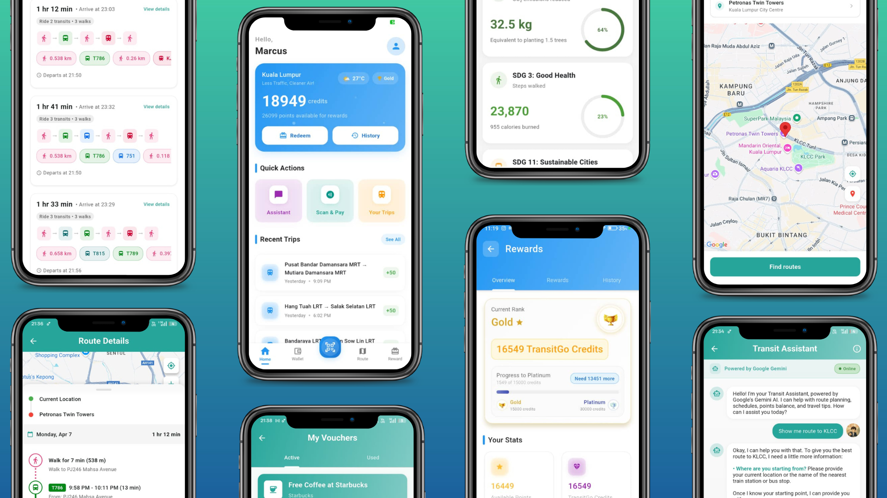

<div align="center">
  
  <h1>TransitGo</h1>
  <p>Tap, ride, and earn—your all-in-one app for sustainable public transit in Malaysia.</p>

  
  
  
  
  

</div>

## 📱 About

**TransitGo** is a Flutter-based mobile application designed to **promote sustainable urban mobility in Malaysia** by simplifying public transit payments and rewarding eco-friendly travel. Built for a hackathon, it **simulates NFC-based tap-and-pay functionality for LRT, MRT,KTM and Bus rides**, allowing users to pay via an eWallet, earn points with a swipe-to-claim system, and track trip history with **Google Maps integration**. Leveraging **Google AI technologies like Firebase for real-time data and Google Maps Platform API for route visualization, and Google Gemini AI Assistant** TransitGo aligns with SDG 11 (Sustainable Cities) and SDG 13 (Climate Action). Whether you're commuting in Kuala Lumpur or beyond, TransitGo makes public transit seamless, rewarding, and green.

- **Key Features:** Simulated NFC Payments, EWallet, Points system, Transit history with maps, Transit Routing.
- **Tech Stack:** Flutter, Dart, Firebase, Google Maps Platform API, Google Gemini
- **Purpose:** Encourage public transit use to reduce urban congestion and carbon emissions.



## ✨ Features

- 🗺️ **Route Planning** - Find optimal routes to a destination using public transportation with step-by-step navigation
- ⏱️ **Real-time Updates** - Get accurate arrival and departure times
- 🔖 **Favorites** - Save frequent locations and routes for quick access
- 📊 **Travel History** - Track and analyze your travel patterns
- 🏆 **Rewards System** - Earn points and credits for using sustainable public transportation

## 🛠️ Tech Stack

<table>
  <tr>
    <th>Category</th>
    <th>Technologies</th>
    <th>Purpose</th>
  </tr>
  <tr>
    <td>Framework</td>
    <td>
      <a href="https://flutter.dev"></a>
      <a href="https://dart.dev"></a>
    </td>
    <td>Cross-platform UI development</td>
  </tr>
  <tr>
    <td>State Management</td>
    <td>
      <a href="https://pub.dev/packages/provider"></a>
    </td>
    <td>Application state management</td>
  </tr>
  <tr>
    <td>Maps & Location</td>
    <td>
      <a href="https://developers.google.com/maps"></a>
      <a href="https://pub.dev/packages/geolocator"></a>
    </td>
    <td>Maps integration and location services</td>
  </tr>
  <tr>
    <td>Storage</td>
    <td>
      <a href="https://pub.dev/packages/shared_preferences"></a>
    </td>
    <td>Local data persistence</td>
  </tr>
  <tr>
    <td>Networking</td>
    <td>
      <a href="https://pub.dev/packages/http"></a>
    </td>
    <td>API communication</td>
  </tr>
  <tr>
    <td>UI Enhancement</td>
    <td>
      <a href="https://pub.dev/packages/lottie"></a>
      <a href="https://pub.dev/packages/slide_to_act"></a>
    </td>
    <td>Animations and interactive components</td>
  </tr>
  <tr>
    <td>Utilities</td>
    <td>
      <a href="https://pub.dev/packages/qr_flutter"></a>
      <a href="https://pub.dev/packages/url_launcher"></a>
      <a href="https://pub.dev/packages/image_picker"></a>
    </td>
    <td>QR code generation, external links, image handling</td>
  </tr>
  <tr>
    <td>Configuration</td>
    <td>
      <a href="https://pub.dev/packages/flutter_dotenv"></a>
    </td>
    <td>Environment variable management</td>
  </tr>
  <tr>
    <td>Cloud Services</td>
    <td>
      <a href="https://firebase.google.com"></a>
    </td>
    <td>Backend services and authentication</td>
  </tr>
  <tr>
    <td>External APIs</td>
    <td>
      <a href="https://openweathermap.org/api"></a>
    </td>
    <td>Real-time weather data and forecasts</td>
  </tr>
  <tr>
    <td>AI Integration</td>
    <td>
      <a href="https://ai.google.dev/"></a>
      <a href="https://ai.google.dev/studio"></a>
    </td>
    <td>AI assistant capabilities</td>
  </tr>
  <tr>
    <td>Voice Recognition</td>
    <td>
      <a href="https://pub.dev/packages/speech_to_text"></a>
    </td>
    <td>Voice input and recognition</td>
  </tr>
</table>

## 📂 Project Structure

TransitGo follows a modular architecture for maintainability and scalability:

```
lib/
├── main.dart                  # Application entry point
├── theme.dart                 # Global theme configuration
│
├── components/                # Reusable UI components
│   ├── buttons/               # Custom button components
│   ├── cards/                 # Card-based UI elements
│   ├── inputs/                # Form and input components
│   └── navigation/            # Navigation-related components
│
├── config/                    # Configuration files
│   ├── api_keys.dart          # API key storage (gitignored)
│   ├── routes.dart            # App navigation routes
│   └── constants.dart         # Global constants
│
├── models/                    # Data models
│   ├── user_model.dart        # User profile data structure
│   ├── transit_model.dart     # Transit-related data structures
│   ├── payment_model.dart     # Payment and transaction models
│   └── rewards_model.dart     # Points and rewards system models
│
├── screens/                   # App screens
│   ├── home/                  # Home screen and related views
│   ├── map/                   # Map-related screens
│   ├── payment/               # Payment flow screens
│   ├── routes/                # Route planning screens
│   ├── profile/               # User profile screens
│   └── rewards/               # Rewards and points screens
│
├── services/                  # External service integrations
│   ├── api_service.dart       # API communication layer
│   ├── location_service.dart  # Location services
│   ├── map_service.dart       # Google Maps integration
│   ├── auth_service.dart      # Authentication service
│   └── storage_service.dart   # Local storage service
│
├── utils/                     # Utility functions
│   ├── formatters.dart        # Text and data formatters
│   ├── validators.dart        # Input validation functions
│   ├── extensions.dart        # Dart extensions
│   └── helpers.dart           # General helper functions
│
└── widgets/                   # Custom widgets
    ├── transit_card.dart      # Transit information card
    ├── route_item.dart        # Route list item
    ├── payment_button.dart    # NFC payment button
    └── reward_card.dart       # Reward display card
```